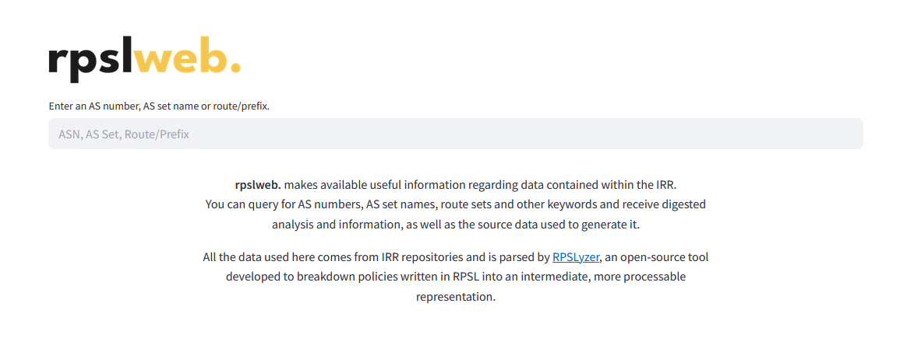
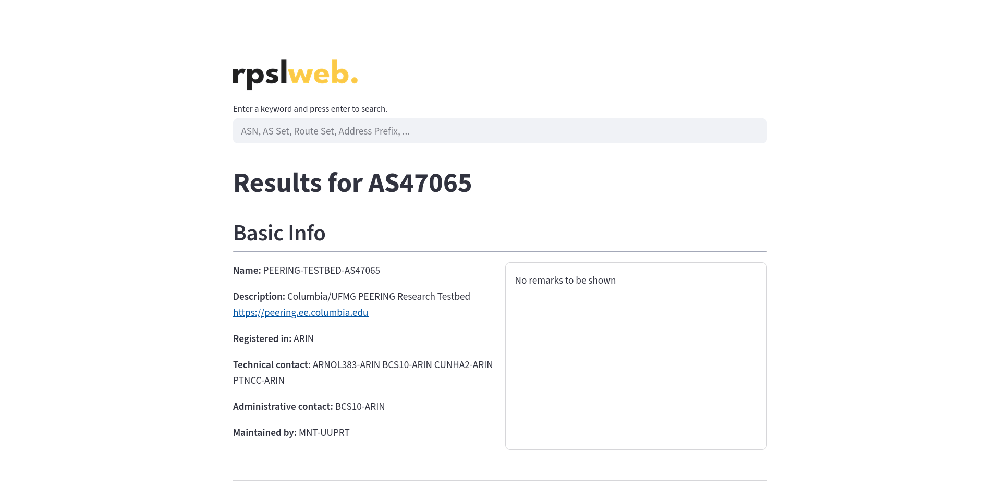

<p align="center">
  
</p>

<div align="center">
    /<rep>/actions/workflows/macos_build.yml/badge.svg">
    /<rep>/actions/workflows/core_build.yml/badge.svg">
    /<rep>/actions/workflows/windows_build.yml/badge.svg">
</div>

# **rpslweb.** Availability of Interpretable Internet Routing Information
**rpslweb.** makes available useful information regarding data contained within the IRR. You can query for AS numbers, AS set names, route sets and other keywords and receive digested analysis and information, as well as the source data used to generate it. All the data used here comes from IRR repositories and is parsed by <a href="https://github.com/SichangHe/internet_route_verification">RPSLyzer</a>, an open-source tool developed to breakdown policies written in RPSL into an intermediate, more processable representation.

<p align="center">
  
</p>

Currently, the following features are supported:

- Search for an **AS number**: returns RPSL 'aut_num' object, list of possible relationships with other ASes (which are infered based on the work of <a href="https://arxiv.org/pdf/2504.10299v1">Amit Zulan et al.</a>);
- Search for an **AS set name**: returns the list of AS members, given by their AS numbers, and the list of AS set members, given by their names;
- Search for a **route/prefix**: returns the list of ASes which export this route/prefix, given by their AS numbers;

<p align="center">
  
</p>

# **Build & Execution (Linux)**

First, clone locally this repository.

```console
git clone https://github.com/bereis01/rpsl_web
cd ./rpsl_web
```

## Preparing the data

First, go to <a href="https://github.com/SichangHe/internet_route_verification">RPSLyzer</a> and follow all steps to generate the .json outputs on the ```parsed_all/``` directory. Next, unite all the .json outputs into a single .json file and put it into a directory ```rpsl_web/back/rpsl_output/``` inside this project's folder.

Next, from the project's root, go to the back-end folder.

```console
cd ./back
```

Create a new python environment, activate it and install requirements.

```console
python3 -m venv ./.venv
source ./.venv/bin/activate
pip install -r requirements.txt
```

Run on the command line the following commands.

```console
python3 -m processor.parsing
python3 -m processor.analysis
```

All required files should be created.

## Back-end

From the project's root, go to the back-end folder.

```console
cd ./back
```

If not already from the previous step, create a new python environment, activate it and install requirements.

```console
python3 -m venv ./.venv
source ./.venv/bin/activate
pip install -r requirements.txt
```

Instantiate the back-end server.

```console
fastapi run app/main.py
```

The back-end server will be accessible through the informed URL. For more information on changing server instantiation parameters - such as address, port, number of workers, and such -, visit <a href="https://fastapi.tiangolo.com/reference/">FastAPI</a>.

## Front-end

From the project's root, go to the front-end folder.

```console
cd ./back
```

Create a new python environment, activate it and install requirements.

```console
python3 -m venv ./.venv
source ./.venv/bin/activate
pip install -r requirements.txt
```

Instantiate the front-end server.

```console
streamlit run app.py
```

The front-end server will be accessible through the informed URL. For more information on changing server instantiation parameters - such as address, port, number of workers, and such -, visit <a href="https://docs.streamlit.io/">Streamlit</a>.