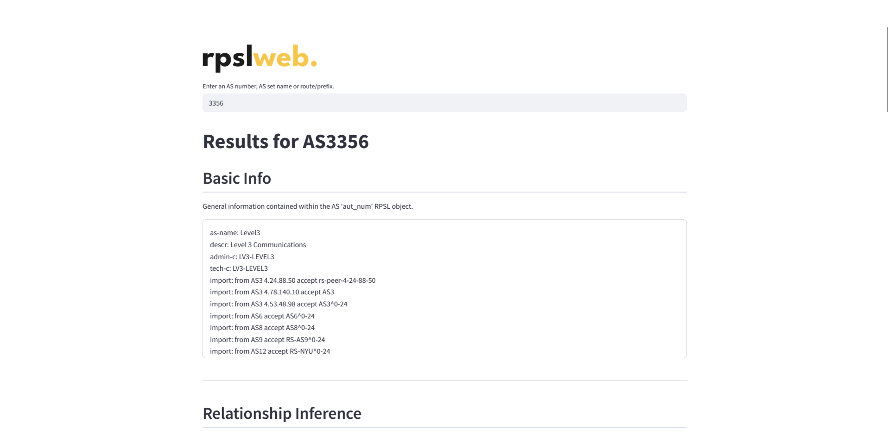

<p align="center">
  
</p>

<div align="center">
    
</div>

# **rpslweb.** Availability of Interpretable Internet Routing Information
**rpslweb.** makes available useful information regarding data contained within the IRR. You can query for AS numbers, AS sets, route sets and other keywords, and receive relevant information pertaining to their RPSL objects. All the data used here comes from IRR repositories and is parsed by <a href="https://github.com/SichangHe/internet_route_verification">RPSLyzer</a>, an open-source tool developed to breakdown policies written in RPSL into an intermediate, more interpretable representation.

<p align="center">
  
</p>

Currently, the following features are supported:

- Search for an **AS number**: returns its attributes (description, maintainer, last modification, ...), its routing policies, a list of possible relationships with other ASes (which are inferred based on the work of <a href="https://arxiv.org/pdf/2504.10299v1">Amit Zulan et al.</a>), the sets it is a member of and the route objects associated with it;
- Search for an **AS set name**: returns its attributes, the list of AS members, given by their AS numbers, and the list of AS set members, given by their names;
- Search for an **address prefix**: returns the list of ASes to which this address prefix is registered as a route object, given by their AS numbers;
- Search for a **route set**: returns its attributes and its list of members, which can be address prefixes, ASes, AS sets and other route sets;

<p align="center">
  
</p>

The platform can be openly accessed through <a href="https://rpslweb.snes.dcc.ufmg.br/">this link</a>.

# **Build & Execution**

## **Docker (recommended)**

First, clone this repository locally with the following commands:

```bash
git clone https://github.com/bereis01/rpsl_web
cd ./rpsl_web
```

Then, build the docker images with the following commands:

```bash
sudo docker compose build
sudo docker volume create rpslweb_data
```

Finally, start the containers with the following commands, **in order**:

```bash
sudo docker compose up rpslyzer
sudo docker compose up data
sudo docker compose up back front
```

The first two commands will execute the images responsible for generating the data used by the platform. They must be executed in this order and their execution may take a while.

The last two commands start the platform itself, which can then be accessed locally through `http://localhost:8501/`.

## **Manually (Linux)**

### Preparing the data

First, it is necessary to download the data from the IRR and execute RPSLyzer. In order to do that, move to the folder `internet_route_verification/` and execute the following commands:

```bash
export MODE="LIVE"
export RAW_DATA_OUTPUT_PATH="../parsed_all"
./execute.sh
```

You may need to give the script execution permissions.

Next, it is necessary to execute the data processor. In order to do that, go out of the `internet_route_verification/` folder, go to the `data/` folder and execute the following commands:

```bash
export DATA_INPUT_PATH="../parsed_all"
export DATA_OUTPUT_PATH="./objects"
python3 -m venv ./.venv
source ./.venv/bin/activate
pip install -r requirements.txt
python3 -m processor -f
deactivate
```

After it has finished processing, all the data has been generated.

### Back-end

Go to the folder `back/` and start the back-end server with the commands:

```bash
export OBJSTR_PATH="../data/objects"
python3 -m venv ./.venv
source ./.venv/bin/activate
pip install -r requirements.txt
fastapi run app/main.py
```

The back-end server will be accessible through the informed URL. For more information on changing server instantiation parameters - such as address, port, number of workers, ... -, refer to <a href="https://fastapi.tiangolo.com/reference/">FastAPI</a>.

### Front-end

Go to the folder `front/` and start the front-end server with the commands:

```bash
export ENDPOINT_ROOT="localhost"
python3 -m venv ./.venv
source ./.venv/bin/activate
pip install -r requirements.txt
streamlit run app.py
```

The front-end server will be accessible through the informed URL. For more information on changing server instantiation parameters - such as address, port, number of workers, ... -, refer to <a href="https://docs.streamlit.io/">Streamlit</a>.
